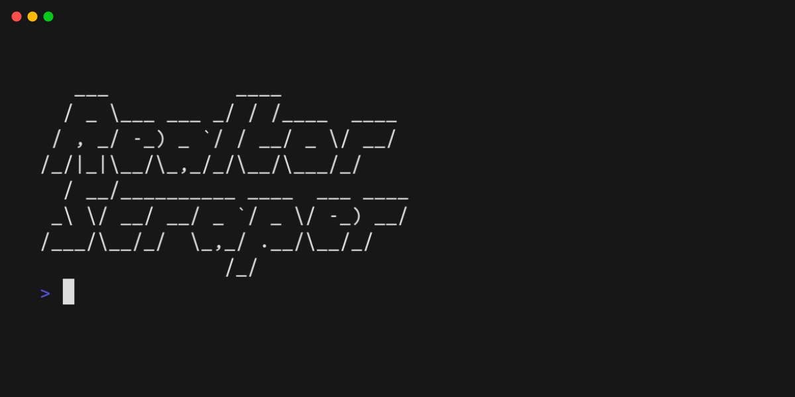

# realtor-scraper


## Overview
This project allows you to scrape all the real estate agents' information, including their contact details and stats from Realtor.com. We do this by reverse-engineering their internal API and bypassing the signing and verification of requests, thereby accessing all the data publicly.



We are using `libsql` to manage the database, which organizes data into various interconnected tables. The database will store crucial information, including agent details, office locations, areas of operation, sales data, and social media profiles. This structure ensures that data remains organized and easily accessible for analysis and future use.


## Prerequisites

Before running the project, make sure you have Go installed on your system.

### Install Go

1. Visit the official Go website: [https://golang.org/dl/](https://golang.org/dl/)
2. Download the appropriate installer for your operating system.
3. Follow the installation instructions for your platform.

To verify the installation, open your terminal or command prompt and run:

```bash
go version
```
This should return the installed version of Go.

### Clone the Project
Once Go is installed, you can clone this project to your local machine.

Run the following command in your terminal:
```bash
git clone https://github.com/suffer-sami/realtor-scraper.git
```

Navigate to the project directory:

```bash
cd realtor-scraper
```

### Install Go Modules
Before running the project, ensure that your Go modules are up to date. Run the following command to tidy up your Go modules:

```bash
go mod tidy
```
This will clean up any unnecessary dependencies and ensure everything is properly installed.

### Install Goose

This project uses Goose for database migrations. To install Goose, run the following command:


```bash
go install github.com/pressly/goose/v3/cmd/goose@latest
```

### Run Migrations
Once Goose is installed, you can apply the migrations to set up the database.

Set the necessary environment variables:

- `GOOSE_DRIVER` — Specifies the database driver.
- `GOOSE_MIGRATION_DIR` — Directory where migration files are located.
- `GOOSE_DBSTRING` — Connection string to your database (local or remote)

Run the migrations with the following command:

```bash
# For local database
GOOSE_DRIVER="turso" GOOSE_MIGRATION_DIR="./sql/schema/" GOOSE_DBSTRING="file:./local.db" goose up

# OR

# For remote turso database
GOOSE_DRIVER="turso" GOOSE_MIGRATION_DIR="./sql/schema/" GOOSE_DBSTRING="libsql://dbname.turso.io?authToken=token" goose up
```

## Run the Project

Follow these steps to configure and run the project:

### Copy the `.env` File

Start by copying the example `.env` file to set up your environment variables:

```bash
cp .env.example .env
```

Edit the .env file to add your details, such as the database connection string, API tokens, and other necessary configuration.

### Run the Project

To run the project, use the following command:

```bash
go run .

# OR
# Run with a custom number of concurrent threads (default: 3)

go run . 5
```
